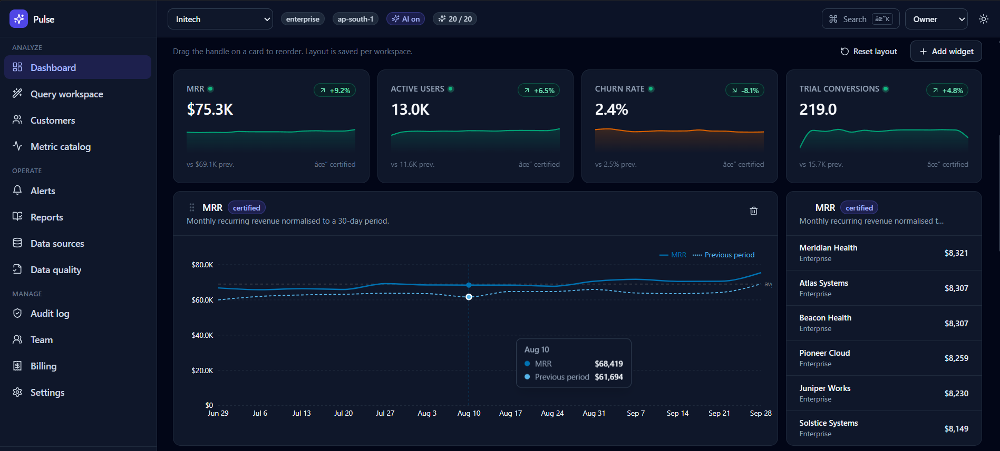
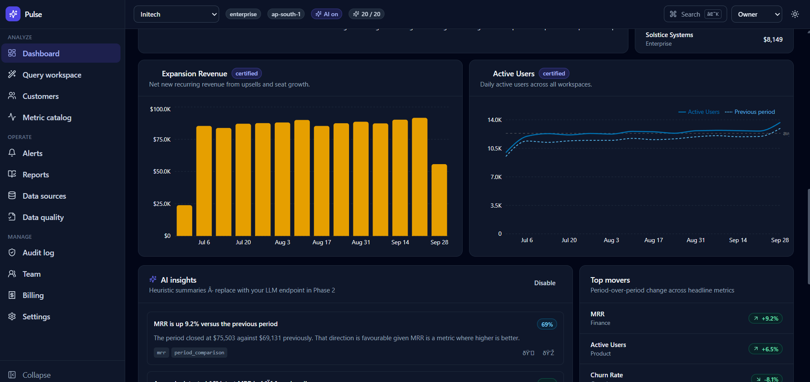
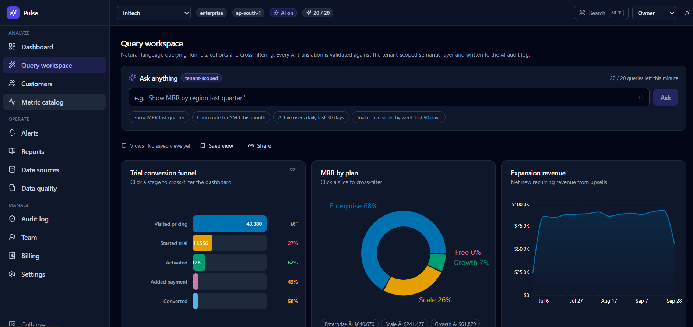

# Pulse — AI-Powered SaaS Analytics Dashboard

> Multi-tenant SaaS analytics platform with natural-language querying, live updates, and AI-generated insights.

**Live demo:**  https://pulse-analytics-topaz.vercel.app/
**Stack:** React 18 · TypeScript · Vite · Tailwind CSS · Recharts · TanStack Query · Zustand

## Features

- Multi-tenant workspaces with per-tenant data isolation
- RBAC across 4 roles (owner / admin / editor / viewer)
- 9 chart types: KPI, line, bar, area, donut, scatter, funnel, cohort heatmap, forecast w/ 80% CI
- Natural-language querying with tenant-scoped guardrails + rate limits
- Live WebSocket updates with reconnect logic
- Real in-browser PDF / CSV / XLSX exports
- Virtualized tables (600+ rows at 60fps)
- Dark mode, ⌘K command palette, WCAG-minded accessibility

## Run locally

\`\`\`bash
git clone https://github.com/Gautam-K03/pulse-analytics.git
cd pulse-analytics
npm install
npm run dev
\`\`\`

Open http://localhost:5173

## Architecture

\`\`\`
src/
├── components/    UI primitives + chart library + shell
├── lib/           metrics (semantic layer), mockApi, nlq (guardrails), audit, reports
├── routes/        12 pages (dashboard, query, customers, metrics, alerts, reports, ...)
├── store.ts       Zustand — app + dashboard + views + annotations + onboarding
├── hooks.ts       TanStack Query + WebSocket + virtualization hooks
└── types.ts       Shared TypeScript contracts
\`\`\`

**No backend required** — `src/lib/mockApi.ts` implements every endpoint in-browser with realistic latency, deterministic per-tenant data, and injectable failures.

# Pulse - AI-Powered SaaS Analytics Dashboard

A working MVP of the analytics dashboard spec: multi-tenant, RBAC-gated,
semantic-layer-driven charts with live updates, natural-language querying,
audit logging, and AI-style insights.

## Run it

    npm install
    npm run dev       # http://localhost:5173
    npm run build     # type-check + production bundle

No backend required - `src/lib/mockApi.ts` implements every endpoint in the
browser with realistic latency, deterministic per-tenant data and injectable
failures.

## Feature coverage

- Multi-tenant workspaces, tenant switcher, per-tenant layout + data isolation
- RBAC (owner/admin/editor/viewer) gating nav and mutations
- Semantic layer / metric catalog (8 certified + draft metrics)
- REST API with pagination, filtering, caching (TanStack Query)
- Dashboard builder: add/remove/reorder widgets, per-tenant persistence
- Charts: KPI, line, bar, area, donut, scatter, funnel, cohort heatmap, forecast
- Global filters: date range, granularity, segment, compare-period
- Cross-filtering, saved views, share links, annotations
- Natural-language querying with tenant-scoped guardrails and rate limits
- AI summaries with confidence scores and source citations
- Forecast with 80% confidence interval
- AI action audit log kept separate from user actions
- Scheduled reports (PDF/CSV/XLSX) with real browser downloads
- Data quality + lineage page
- Feature flags & entitlements on the Billing page
- Team management with MFA status
- Onboarding / first-run flow
- Dark mode, command palette, WCAG-minded

## Demo controls

- `window.__pulseControl.failureRate = 0.4` - inject API failures
- `window.__pulseControl.latency = [800, 2000]` - slow the API down
- Or use the sliders on the Data sources page

## Swapping in a real backend

Every network call lives in `src/lib/mockApi.ts`. Replace each exported
function with a fetch against `import.meta.env.VITE_API_BASE_URL`, keep the
same signature, and the rest of the app is unchanged.

## Architecture notes

- Semantic layer first. `src/lib/metrics.ts` owns the definition of a metric
  (aggregation, format, direction). Charts never hardcode a formula.
- Tenant scoping is a query-key concern. Every hook reads `tenantId` from the
  store, so a tenant switch invalidates everything automatically.
- RBAC is declarative. Add a permission string to `PERMISSIONS` and gate with
  `usePermission()`; no scattered role checks.
- Graceful AI degradation. `buildInsights` and `translateQuery` return explicit
  states when disabled, low-confidence, or blocked, and the UI renders a clear
  message rather than hiding the chart.
